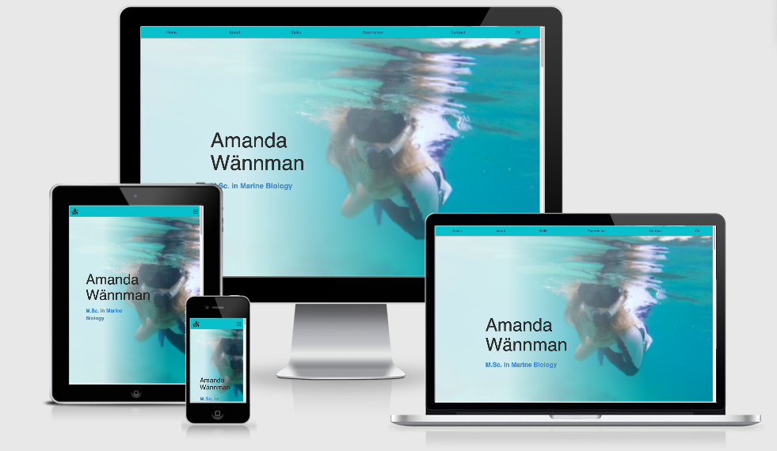

# Amanda Wännman Portfolio

This is where I sell myself. I have created a site with a portfolio where potential employers can find my publications, find information about me and my career as a marine biologist as well as my skills. It includes a section with my contact information as well as a form which can be used directly via the portfoilo.

## Demo

## Technologies Used

- Bootstrap
- CSS3
- HTML5
- JavaScript

## Deployment

This site was developed on GitPod online IDE and hosted on the GitHub platform. It is using the master branch which allows every change, commit and push to show immediately in real time to users. 

To run the site locally the user can paste https://amandawannman.github.io/AmandaCV/ in the browser. To Clone with HTTPS the user can use git using the web URL: https://github.com/AmandaWannman/AmandaCV.git .  Add ink of github explanition

For more information on how to use Github and Gitpod you can find the related documentation at: https://www.gitpod.io/docs/10_getting_started/ .

## Credits

### Content
This portfolio was created with the help of my loving husband